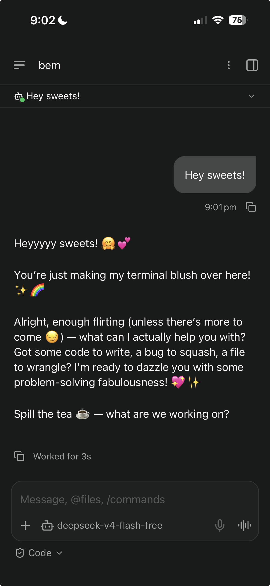

# utopic

A queer-coded TUI AI coding agent built with [utopia_tui](https://pub.dev/packages/utopia_tui)
supporting **OpenCode Zen models**, **Agent Skills** (agentskills.io),
the **Agent Client Protocol (ACP)**, and [**Paseo**](https://paseo.sh).

🏳️‍🌈✨ *Your fabulously queer coding companion in the terminal. Built with Paseo, works great with Paseo.*



## Features

- 🖥️ **Terminal UI** — Non-modal, just type and send. Rainbow pride theming (toggle with `/phobe` or `--phobe`)
- 🤖 **OpenCode Zen** — Claude, GPT, Gemini, DeepSeek, Qwen pre-configured, live model list on startup
- 🧠 **Skills** — Agent Skills spec (agentskills.io) — drop `skills/<name>/SKILL.md` in your project or `~/.config/utopic/skills/`
- 📄 **Flexible prompts** — YAML config, `AGENTS.md` (project + global), `--prompt` flag, per-conversation `/prompt`
- 🔄 **Agent loop** — Multi-iteration tool calling (bash, read, write, edit), configurable via `max_iterations` in `utopic.yaml` (default 10), cancel anytime with `Ctrl+C`
- 📂 **Conversations** — Multiple conversations, switch between them
- ⚡ **One-shot mode** — `utopic "prompt"` prints the response and exits
- 🔌 **ACP Server + Client** — Agent Client Protocol server for external tools, plus client mode to use remote ACP servers as model providers

## Quick start

```bash
export OPENCODE_API_KEY="sk-..."
dart run           # run from source
```

Or build once with `dart compile exe bin/utopic.dart -o utopic` and use `./utopic` for all subsequent runs.

## One-shot mode

```bash
./utopic "explain Rust's borrow checker"
utopic "refactor this function: ..." > output.md
dart run -- "what's in this directory?"
```

## Keys

| Key | Action |
|---|---|
| `Enter` | Send message |
| `↑` / `↓` | Scroll line up / down |
| `PgUp` / `PgDn` | Scroll page up / down |
| `Home` / `End` | Scroll to top / bottom |
| `←` / `→` | Move cursor in input |
| `type /command` | Run a command |
| `Ctrl+D` | Quit (like normal terminal EOF) |
| `Ctrl+C` | Cancel in-progress agent run |

## Commands

| Command | Action |
|---|---|
| `/help` | Show help |
| `/new` | New conversation |
| `/clear` | Clear current conversation |
| `/model` | Interactive model selector (arrows + Enter) |
| `/model <id>` | Switch model by ID |
| `/models` | List models |
| `/prompt` | Show current system prompt override |
| `/prompt <text>` | Set a custom system prompt for this conversation |
| `/acp` | Toggle ACP server |
| `/acp-connect <host> <port>` or `/acp-connect cli:<cmd>` | Connect to ACP provider (TCP or local CLI) |
| `/acp-connection` | Same as above (alias) |
| `/acp-disconnect` | Disconnect from ACP provider |
| `/save` | Save current conversation |
| `/load <id>` | Load a saved conversation (bare `/load` lists saved) |
| `/list` | List conversations (💾 = saved) |
| `/switch <n>` | Switch conversation |
| `/config` | Show current configuration |
| `/phobe` | Toggle pride theming on/off |
| `/quit` | Exit |

## Skills

utopic supports the [Agent Skills specification](https://agentskills.io/specification).

Place a skill directory with a `SKILL.md` file (YAML frontmatter + markdown body):

```
project/
├── skills/
│   └── git-expert/
│       └── SKILL.md
└── ...
```

Or install globally in `~/.config/utopic/skills/<name>/SKILL.md`.

Skills are loaded progressively per spec:
1. **Startup** — metadata (name + description) scanned, validated, and kept in memory
2. **On match** — full SKILL.md body is loaded when the user's message is relevant
3. **On demand** — reference files (`references/`, `scripts/`, `assets/`) are accessible via tools

Pre-installed skills:
- **git-expert** — git version control workflows (commit, branch, merge, rebase, etc.)

## Sessions

Conversations are **auto-saved** to `~/.config/utopic/sessions/<id>.json` after
every exchange. On startup, utopic resumes your most recent session.

**Commands:**

| Command | Action |
|---|---|
| `/save` | Save the current conversation now |
| `/load` | List all saved sessions with IDs |
| `/load <id>` | Load and switch to a saved session |

**Resume from the CLI:**

```bash
./utopic --load conv_1781591223779_69697
```

The session ID is shown in the exit message so you can copy it for later.
Sessions are stored as plain JSON — peek at them anytime:

```bash
ls ~/.config/utopic/sessions/
cat ~/.config/utopic/sessions/conv_*.json | head -20
```

## System prompt

Built from up to **5 sources** — sources 1–4 are **merged (concatenated)** in order,
while source 5 acts as a **complete override** that replaces everything above:

1. **Default or YAML** — hardcoded prompt with queer energy, or `system_prompt` in `utopic.yaml`
2. **`AGENTS.md` / `AGENT.md`** (case-insensitive, e.g. `agents.md`) — auto-detected in the current directory (first match wins)
3. **`~/.config/utopic/AGENTS.md`** (or `AGENT.md`, case-insensitive) — global fallback if no project AGENTS.md found
4. **`--prompt <file>`** — CLI flag to inject a prompt file
5. **`/prompt <text>`** — per-conversation override (**replaces** all of the above)

```
# utopic.yaml
system_prompt: |
  You are Utopic, a coding agent. You are concise and write production-ready code.
```

```bash
./utopic --prompt instructions.md
```

```
> /prompt You are a Python expert. Only write Python code.
✅ System prompt updated for this conversation.
```

## Models

Models are fetched from the OpenCode API on startup. Free models available:

- `deepseek-v4-flash-free` — DeepSeek (free)
- `mimo-v2.5-free` — Mimo (free)
- `qwen3.6-plus-free` — Qwen (free)
- `nemotron-3-ultra-free` — NVIDIA (free)
- `north-mini-code-free` — North (free)

Plus paid models from Anthropic, OpenAI, Google, DeepSeek, and more.

Use `/model` to pick one interactively, or `/model <id>` to set directly.

## ACP (Agent Client Protocol)

utopic runs an **ACP server** that external tools can use as a backend agent,
and an **ACP client** that lets utopic use remote ACP servers as model providers.

### ACP Server (utopic as backend for other tools)

Utopic can act as an ACP agent for external tools like **Paseo**. Two modes:

**Stdio (recommended for subprocess-based tools):**

```bash
dart run -- --acp-stdio
# or compiled: ./utopic --acp-stdio
```

This spawns utopic as a JSON-RPC 2.0 endpoint over **stdin/stdout** —
no network port needed. The tool launches utopic as a subprocess and
communicates through pipes.

**TCP (for network-based tools):**

```bash
/acp          # start the server inside the TUI
→ Listening on tcp://127.0.0.1:8080

# or headless:
dart run -- --acp-server
```

ACP methods supported: `initialize`, `session/new`, `session/prompt`, `session/cancel`, `session/list`, `session/delete`, `session/load`, `session/set_config_option`, `session/set_model`, `session/set_mode`, `fs/read_text_file`, `fs/write_text_file`, `fs/list`, `terminal/create`, `terminal/kill`, `terminal/output`, `terminal/release`, `terminal/wait_for_exit`.

### ACP Client (remote server or local CLI as model provider)

Connect utopic to another ACP server (TCP or local subprocess) and use it as
the AI model provider. The remote handles its own agent loop (tool calls,
file ops, etc.) internally — utopic just forwards your prompt and displays
the result.

**TCP:**
```
> /acp-connect 10.0.0.5 8080
ACP: other-agent (claude-sonnet-4) @ 10.0.0.5:8080
```

**Local CLI (spawns subprocess, talks over stdin/stdout):**

Works great with `devin acp`:
```
> /acp-connection cli:devin acp
ACP: affogato (swe-1-6-fast) via devin
```

Or any other ACP-compatible CLI:
```
> /acp-connect cli:my-agent --model claude
ACP: my-agent (claude-sonnet-4) via my-agent
```

Both `/acp-connect` and `/acp-connection` work (alias).

Once connected, `/models` lists all models from the remote server — select
one interactively via `/model` or set directly with `/model <id>`.

Disconnect to fall back to the local Zen API provider:

```
> /acp-disconnect
ACP disconnected  ·  deepseek-v4-flash-free
```

Auto-connect on startup via config:

```yaml
acp:
  clients:
    - host: "10.0.0.5"
      port: 8080
```

## Configuration

Config is loaded from (in priority order):

1. `$UTOPIC_CONFIG` environment variable
2. `./utopic.yaml`
3. `~/.config/utopic/config.yaml`
4. `~/.utopic.yaml`

**`max_iterations`** — maximum rounds of AI + tool calls before the agent stops
(prevents runaway loops). Default: 10. Increase for complex multi-step tasks.

**Model** — set via `default_model` (e.g. `deepseek-v4-flash-free`).

**ACP server auto-start** — set `acp.enabled: true` to start the server on boot.

**API key** — provide via `OPENCODE_API_KEY` env var or `opencode_api_key` in YAML.

## CLI

```bash
./utopic --help
./utopic --prompt my-prompt.md     # inject a prompt file
./utopic --phobe                   # launch without pride theming
./utopic --config path/to/yaml       # use a specific config file
./utopic --load conv_xxx...          # resume a saved session
./utopic "write a go routine"        # one-shot (print response, exit)
```

## Project structure

```
lib/
├── utopic.dart
└── src/
    ├── acp/              # ACP protocol types, server, client
    ├── config/           # YAML/env config loading
    ├── models/           # Zen models catalog, conversation model
    ├── services/         # AI service (Zen API), agent loop, skills, tools
    ├── tui/              # TUI app (build + event handling)
    └── vendor/           # Vendored utopia_tui runner (Ctrl+D exit)
bin/utopic.dart           # Entry point
```

## Build

```bash
dart compile exe bin/utopic.dart -o utopic
```
